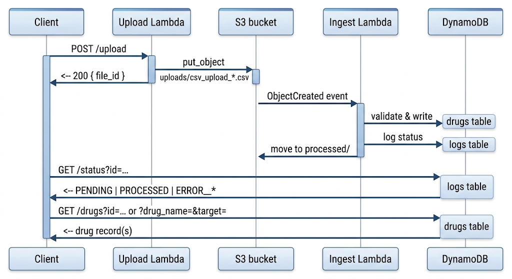

# Drug–Target Efficacy API

A serverless pipeline for uploading CSV files of drug/target efficacy data, validating and loading them into DynamoDB, and querying the results — built on API Gateway (REST/v1), Lambda, S3, and DynamoDB.

## How it works



1. A client uploads a raw CSV to **`POST /upload`**.
2. The file lands in the S3 bucket under `uploads/`, which triggers the **ingest** Lambda asynchronously via an S3 event notification.
3. The ingest Lambda validates the file, writes one row per drug/target pair to the drugs table, and records a status entry in the logs table (success or a specific error code). The source file is then moved to a `processed/` prefix.
4. The client polls **`GET /status`** using the `file_id` returned at upload time.
5. Once processing succeeds, the client can look up individual drugs or search by name/target via **`GET /drugs`**.

## Base URL

Deployed as a single REST API (`aws_api_gateway_rest_api`) with one stage named after `var.environment`:

```
https://{api-id}.execute-api.{region}.amazonaws.com/{environment}
```

All paths below are relative to this base URL. **No authorization is configured on any method** (`authorization = "NONE"`) — the API is open to anyone who can reach the endpoint unless you add an authorizer, API key, or a WAF/resource policy in front of it.

## Endpoints

### `POST /upload`
Uploads a CSV file for processing.

- **Body:** raw CSV text, or base64-encoded CSV if `isBase64Encoded: true` is set by API Gateway.
- **Response `200`:**
  ```json
  {
    "message": "CSV uploaded successfully",
    "file_id": "3f9b6e2a-...",
    "file_key": "uploads/csv_upload_3f9b6e2a-....csv"
  }
  ```
- **Response `400`:** empty/missing body.
- **Response `500`:** unexpected error (message includes exception text).

The returned `file_id` is the same identifier used by `/status` — save it to poll for processing results.

### `GET /drugs`
Looks up drug/target efficacy records.

- **Query parameters** (all optional per the API Gateway method config, though at least one is expected for a meaningful result):
  - `id` — direct primary-key lookup. If present, `drug_name`/`target` are ignored.
  - `drug_name` — exact-match filter.
  - `target` — exact-match filter.
- **Response `200`**, direct `id` lookup:
  ```json
  { "id": "…", "drug_name": "Imatinib", "target": "BCR-ABL", "efficacy": 0.87, "source_file": "uploads/csv_upload_….csv" }
  ```
- **Response `200`**, filtered search:
  ```json
  { "count": 2, "items": [ { "...": "..." }, { "...": "..." } ] }
  ```
- **Response `404`:** no item for the given `id`.
- **Response `500`:** unexpected error.

⚠️ With no `id`, this endpoint performs a full **table scan** (paginated internally) with an optional `FilterExpression` on `drug_name`/`target` — those attributes aren't indexed. This is fine for small tables; for larger datasets, add a GSI on `drug_name`/`target` and switch to a `Query`.

### `GET /status`
Checks whether an uploaded file has finished processing. `id` is a **required** query parameter at the API Gateway level.

- **Query parameters:** `id` (preferred) or `filename` — the Lambda accepts either, both refer to the same file id.
- **Response `200`** — processing finished (success or failure):
  ```json
  { "id": "3f9b6e2a-...", "status": "PROCESSED", "comment": "Successfully processed 42 row(s)." }
  ```
- **Response `202`** — no log entry yet, still processing:
  ```json
  { "id": "3f9b6e2a-...", "status": "PENDING", "message": "File has not finished processing yet. Try again shortly." }
  ```
- **Response `400`:** missing `id`/`filename`.

## CSV format

Uploaded files must be valid CSV with a header row containing at least:

| Column      | Type                | Notes                                  |
|-------------|---------------------|-----------------------------------------|
| `drug_name` | string, non-empty   | trimmed of surrounding whitespace       |
| `target`    | string, non-empty   | trimmed of surrounding whitespace       |
| `efficacy`  | float, `0.0`–`1.0`  | inclusive range                         |

Additional columns are ignored. Each row is written as its own item, keyed by `id = sha256("{drug_name}:{target}")` — re-uploading the same drug/target pair overwrites the existing record rather than duplicating it.

The ingest Lambda only fires for objects created under `uploads/` with a `.csv` suffix (S3 event notification filter), so files placed elsewhere in the bucket won't be picked up.

## Processing status codes

Written to the logs table by the ingest Lambda:

| Status                          | Meaning                                              |
|-----------------------------------|--------------------------------------------------------|
| `PROCESSED`                       | File processed successfully                            |
| `ERROR__MISSING_HEADER`           | CSV has no header row                                   |
| `ERROR__MISSING_COLUMNS`          | One or more required columns absent                     |
| `ERROR__EMPTY_DRUG_NAME`          | A row had a blank `drug_name`                           |
| `ERROR__EMPTY_TARGET`             | A row had a blank `target`                              |
| `ERROR__INVALID_EFFICACY`         | `efficacy` wasn't a valid number                         |
| `ERROR__INVALID_EFFICACY_RANGE`   | `efficacy` was outside `0`–`1`                           |
| `ERROR__UNKNOWN`                   | Any other unhandled exception during processing          |

Note that validation fails the **entire file** on the first bad row — processing is all-or-nothing per upload, not per-row.

## Data model

**Drugs table** — `${project_name}-${environment}-drugs`, partition key `id` (String), on-demand billing (`PAY_PER_REQUEST`)

| Attribute     | Type   | Description                              |
|---------------|--------|-------------------------------------------|
| `id`          | String | `sha256(drug_name:target)`                |
| `drug_name`   | String |                                             |
| `target`      | String |                                             |
| `efficacy`    | Number | Decimal, 0–1                               |
| `source_file` | String | S3 key of the CSV the row came from        |

**Logs table** — `${project_name}-${environment}-logs`, partition key `id` (String), on-demand billing (`PAY_PER_REQUEST`)

| Attribute | Type   | Description                                 |
|-----------|--------|-----------------------------------------------|
| `id`      | String | file id (matches upload's `file_id`)         |
| `status`  | String | one of the processing status codes above      |
| `comment` | String | human-readable detail                         |

Both tables have only a partition key defined — no sort key or secondary indexes — so `/drugs` searches by `drug_name`/`target` are scans rather than indexed queries (see the endpoint note above).

## Infrastructure

Provisioned via Terraform across four files:

**`main.tf`** — the S3 bucket used for CSV staging:
- Named `${project_name}-${environment}-staging`.
- Versioning toggled by `enable_versioning`.
- Server-side encryption with `AES256`.
- Public access fully blocked (ACLs, bucket policy, and public buckets all blocked).

**`dynamodb.tf`** — the two tables described above (`drugs`, `logs`), both `PAY_PER_REQUEST` with a single `id` partition key.

**`lambda.tf`** — four Lambda functions, each zipped from a `src/<name>` directory, plus their supporting resources:

| Terraform resource | Function name                            | Trigger              | Role                              |
|---------------------|--------------------------------------------|-----------------------|--------------------------------------|
| `aws_lambda_function.upload`         | `${project_name}-${environment}-get-file` | API Gateway `POST /upload` | `var.upload_iam_role_arn` |
| `aws_lambda_function.ingest`         | `${project_name}-${environment}-ingest`   | S3 `ObjectCreated` on `uploads/*.csv` | `var.ingest_iam_role_arn` |
| `aws_lambda_function.get_drugs`      | `${project_name}-${environment}-get-data` | API Gateway `GET /drugs` | `var.get_drugs_iam_role_arn` |
| `aws_lambda_function.get_job_status` | `${project_name}-${environment}-get-logs` | API Gateway `GET /status` | `var.get_job_status_iam_role_arn` |

Runtime, handler, timeout, and memory size are shared across all four via `var.runtime` / `var.handler` / `var.timeout` / `var.memory_size`. IAM roles are passed in as ARNs rather than defined in this file — provision them separately with least-privilege access to their respective table(s)/bucket. Explicit CloudWatch log groups (14-day retention) are only defined here for `get_drugs` and `get_job_status`; `upload` and `ingest` will fall back to Lambda's default (never-expire) log group unless one is added.

**`api_gateway.tf`** — the REST API, its three resources/methods (`POST /upload`, `GET /drugs`, `GET /status`), `AWS_PROXY` integrations to the corresponding Lambda, and the Lambda invoke permissions and deployment/stage. All methods use `authorization = "NONE"`.

## Environment variables

| Lambda           | Variables                          |
|-------------------|--------------------------------------|
| `upload`           | `BUCKET_NAME`, `LOG_TABLE`\*         |
| `ingest`            | `DRUGS_TABLE_NAME`, `LOG_TABLE`      |
| `get_drugs`         | `DRUGS_TABLE_NAME`                   |
| `get_job_status`    | `LOG_TABLE`                          |

\* `LOG_TABLE` is set on the `upload` function but isn't referenced anywhere in its handler code — currently unused, but available if you want the upload step to pre-seed a `PENDING` log entry.

## Example usage

```bash
# 1. Upload a CSV
curl -X POST https://{api-id}.execute-api.{region}.amazonaws.com/{environment}/upload \
  --data-binary @drugs.csv

# 2. Poll for status
curl "https://{api-id}.execute-api.{region}.amazonaws.com/{environment}/status?id=3f9b6e2a-..."

# 3. Query results
curl "https://{api-id}.execute-api.{region}.amazonaws.com/{environment}/drugs?drug_name=Imatinib"
```